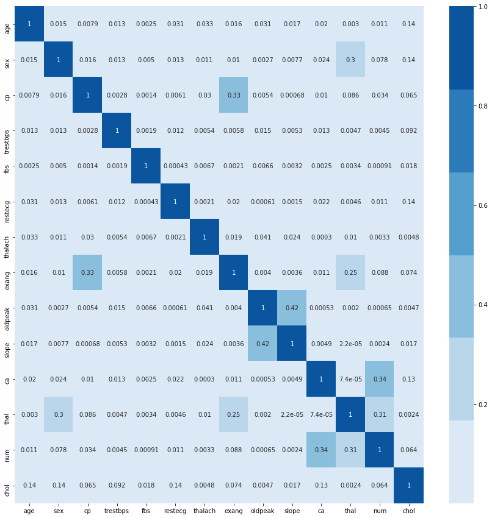
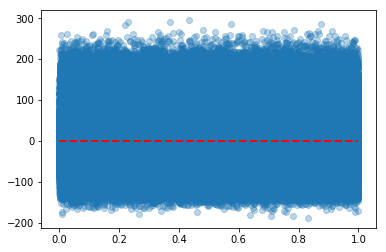
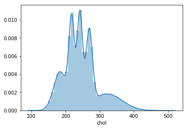

### Questions
- What differentiates hetereoskedacicity vs homoskedacsticity 

Datasets:

- Weather Data set found [here](https://www.kaggle.com/budincsevity/szeged-weather)

### Objectives
YWBAT
* Apply techniques to solve a multiple linear regression problem
* Create multilinear regression models and change them to optimize results

### Outline
- Clone lesson repo to your local
- Breakout groups to build a model
    - both people should be coding
    - 1 person can screenshare
    - you can divide work (divide and conquer!)
    - Save 5-8 minutes to write a conclusion
- Present model to the class (conclusion)


```python
import pandas as pd
import numpy as np
import scipy.stats as scs
import statsmodels.api as sm

from sklearn.model_selection import train_test_split
from sklearn.linear_model import LinearRegression
from sklearn.model_selection import cross_val_score
from sklearn.metrics import r2_score, make_scorer
from sklearn.preprocessing import StandardScaler

import matplotlib.pyplot as plt
import seaborn as sns
```

### Task, build a model in 35-40 minutes and present it to the class 
Dataset - ```BNG_cholesterol.csv ```

Target - ```chol```

No. Features - ```13```


```python
df = pd.read_csv("./data/BNG_cholesterol.csv")
df.head()
```


<div>
<style scoped>
    .dataframe tbody tr th:only-of-type {
        vertical-align: middle;
    }

    .dataframe tbody tr th {
        vertical-align: top;
    }

    .dataframe thead th {
        text-align: right;
    }
</style>
<table border="1" class="dataframe">
  <thead>
    <tr style="text-align: right;">
      <th></th>
      <th>age</th>
      <th>sex</th>
      <th>cp</th>
      <th>trestbps</th>
      <th>fbs</th>
      <th>restecg</th>
      <th>thalach</th>
      <th>exang</th>
      <th>oldpeak</th>
      <th>slope</th>
      <th>ca</th>
      <th>thal</th>
      <th>num</th>
      <th>chol</th>
    </tr>
  </thead>
  <tbody>
    <tr>
      <td>0</td>
      <td>46.950938</td>
      <td>1</td>
      <td>1</td>
      <td>165.981331</td>
      <td>0</td>
      <td>2</td>
      <td>152.691434</td>
      <td>0</td>
      <td>1.774223</td>
      <td>2</td>
      <td>0</td>
      <td>7</td>
      <td>3</td>
      <td>265.569780</td>
    </tr>
    <tr>
      <td>1</td>
      <td>47.359284</td>
      <td>1</td>
      <td>4</td>
      <td>134.748286</td>
      <td>0</td>
      <td>2</td>
      <td>132.079047</td>
      <td>1</td>
      <td>0.407640</td>
      <td>2</td>
      <td>0</td>
      <td>7</td>
      <td>0</td>
      <td>269.368061</td>
    </tr>
    <tr>
      <td>2</td>
      <td>58.455787</td>
      <td>1</td>
      <td>4</td>
      <td>129.456617</td>
      <td>0</td>
      <td>0</td>
      <td>164.523754</td>
      <td>1</td>
      <td>5.284900</td>
      <td>2</td>
      <td>0</td>
      <td>7</td>
      <td>4</td>
      <td>244.336917</td>
    </tr>
    <tr>
      <td>3</td>
      <td>56.070298</td>
      <td>1</td>
      <td>4</td>
      <td>124.831749</td>
      <td>0</td>
      <td>2</td>
      <td>181.453944</td>
      <td>0</td>
      <td>1.096476</td>
      <td>1</td>
      <td>1</td>
      <td>7</td>
      <td>2</td>
      <td>237.985356</td>
    </tr>
    <tr>
      <td>4</td>
      <td>44.121116</td>
      <td>1</td>
      <td>4</td>
      <td>109.887955</td>
      <td>0</td>
      <td>2</td>
      <td>110.055090</td>
      <td>1</td>
      <td>0.437412</td>
      <td>2</td>
      <td>0</td>
      <td>3</td>
      <td>1</td>
      <td>245.907334</td>
    </tr>
  </tbody>
</table>
</div>


```python
df.shape
```


    (1000000, 14)


```python
corr = df.corr()

plt.figure(figsize=(15, 15))
sns.heatmap(corr.abs(), annot=True, cmap=sns.color_palette('Blues'))
plt.show()
```





### What makes for good AIC/BIC?
The lowest AIC/BIC

- Akaike’s Inflation Coefficient
- Bayes Inflation Coefficient - penalizes for number of features

BIC - the leanest/meanest (low -> best) - penalizes features

AIC - go between (accounting for explanation of variance and takes into account the sample size)

### Tools to use

> BoxCox will fit x to y in a linear relationship because it shows transformation needed to make x and y morenormally related

https://docs.scipy.org/doc/scipy/reference/generated/scipy.stats.boxcox.html

>VIF (Variance Inflation Factor)

https://etav.github.io/python/vif_factor_python.html


```python
def make_ols(df, target='chol', columns_to_use = ['age', 'thalach'], 
             add_constant=False, display_summary=False,
             display_vif=True):
    X = df[columns_to_use]
    y = df[target]
    if add_constant:
        X = sm.add_constant(X)
    linreg = sm.OLS(y, X).fit()
    if display_summary:
        display(linreg.summary())
    if display_vif:
        print(1 / (1 - linreg.rsquared))
    return linreg
```


```python
linreg = make_ols(df, display_summary=True)
```


<table class="simpletable">
<caption>OLS Regression Results</caption>
<tr>
  <th>Dep. Variable:</th>          <td>chol</td>       <th>  R-squared (uncentered):</th>       <td>   0.951</td>  
</tr>
<tr>
  <th>Model:</th>                   <td>OLS</td>       <th>  Adj. R-squared (uncentered):</th>  <td>   0.951</td>  
</tr>
<tr>
  <th>Method:</th>             <td>Least Squares</td>  <th>  F-statistic:       </th>           <td>9.662e+06</td> 
</tr>
<tr>
  <th>Date:</th>             <td>Tue, 05 Nov 2019</td> <th>  Prob (F-statistic):</th>            <td>  0.00</td>   
</tr>
<tr>
  <th>Time:</th>                 <td>13:29:22</td>     <th>  Log-Likelihood:    </th>          <td>-5.4429e+06</td>
</tr>
<tr>
  <th>No. Observations:</th>      <td>1000000</td>     <th>  AIC:               </th>           <td>1.089e+07</td> 
</tr>
<tr>
  <th>Df Residuals:</th>          <td>999998</td>      <th>  BIC:               </th>           <td>1.089e+07</td> 
</tr>
<tr>
  <th>Df Model:</th>              <td>     2</td>      <th>                     </th>               <td> </td>     
</tr>
<tr>
  <th>Covariance Type:</th>      <td>nonrobust</td>    <th>                     </th>               <td> </td>     
</tr>
</table>
<table class="simpletable">
<tr>
     <td></td>        <th>coef</th>     <th>std err</th>      <th>t</th>      <th>P>|t|</th>  <th>[0.025</th>    <th>0.975]</th>  
</tr>
<tr>
  <th>age</th>     <td>    2.5407</td> <td>    0.004</td> <td>  567.740</td> <td> 0.000</td> <td>    2.532</td> <td>    2.549</td>
</tr>
<tr>
  <th>thalach</th> <td>    0.7082</td> <td>    0.002</td> <td>  433.499</td> <td> 0.000</td> <td>    0.705</td> <td>    0.711</td>
</tr>
</table>
<table class="simpletable">
<tr>
  <th>Omnibus:</th>       <td>61638.553</td> <th>  Durbin-Watson:     </th> <td>   1.998</td> 
</tr>
<tr>
  <th>Prob(Omnibus):</th>  <td> 0.000</td>   <th>  Jarque-Bera (JB):  </th> <td>76647.024</td>
</tr>
<tr>
  <th>Skew:</th>           <td> 0.605</td>   <th>  Prob(JB):          </th> <td>    0.00</td> 
</tr>
<tr>
  <th>Kurtosis:</th>       <td> 3.612</td>   <th>  Cond. No.          </th> <td>    13.6</td> 
</tr>
</table><br/><br/>Warnings:<br/>[1] Standard Errors assume that the covariance matrix of the errors is correctly specified.


```python
residuals = linreg.resid
```


```python

```


```python
xs = np.linspace(0, 1, len(residuals))
plt.scatter(xs, residuals, alpha=0.3)
plt.hlines(y=0, xmin=0, xmax=1, linestyle='dashed', colors='r', linewidth=2)
plt.show()
```





```python
linreg.rsquared
```


    0.9507964500843937


### Track your model stats in stepwise selection:
{mod1: {features_used:[], p_values:[], AIC:[], BIC:[], JB:[]}}

### Clean Data


```python
# our data is cleaned
```

### Correlation Matrix + Interpretation


```python
# see above
```

### Baseline Model Using scipy.stats


```python
# see above
```

### Baseline Model Using sklearn


```python

```

### let's look for multicollinearity in our variables using VIF

# what is multicollinearity
- the independent variables are correlated
- it's bad
- doesn't always have to be independent, but for the sake of modeling, it is usually independent
- doubling information for one variable
- selected features have a positive relationship amongst themselves and the target
- 2 or more variables
- when 2 features are more related to each other than they are the target
- when 1 variable can be explained using the other variables with a R2

### Iterate through features, looking at R2, then VIF


```python
# let's check each column, build a model and get the r2
vif_scores = []

for column in df.columns:
    columns_to_use = df.drop(columns=[column, 'chol']).columns
    target = column
    linreg = make_ols(df, target=target, columns_to_use=columns_to_use)
    R2 = linreg.rsquared
    VIF = 1 / (1 - R2)
    print(f"VIF for {column} = {VIF}")
    vif_scores.append((column, VIF, R2))
```

    VIF for age = 29.151688922207345
    VIF for sex = 3.4938619746931736
    VIF for cp = 11.966992904577227
    VIF for trestbps = 37.60716784357191
    VIF for fbs = 1.1802127024523554
    VIF for restecg = 2.0109361058659707
    VIF for thalach = 30.30625597942151
    VIF for exang = 1.8121210852367335
    VIF for oldpeak = 2.53730743815354
    VIF for slope = 9.143351318503155
    VIF for ca = 1.7577404077694698
    VIF for thal = 9.17384484870623
    VIF for num = 2.199873413962072
    VIF for chol = 24.40102185834321


```python

```


```python
vif_scores_sorted = sorted(vif_scores, key=lambda x: x[1])
vif_scores_sorted
```


    [('fbs', 1.1802127024523554, 0.15269510493989158),
     ('ca', 1.7577404077694698, 0.4310877786163112),
     ('exang', 1.8121210852367335, 0.4481604964773306),
     ('restecg', 2.0109361058659707, 0.5027191579667971),
     ('num', 2.199873413962072, 0.5454283898095051),
     ('oldpeak', 2.53730743815354, 0.6058814217926527),
     ('sex', 3.4938619746931736, 0.7137837707261407),
     ('slope', 9.143351318503155, 0.8906309114496862),
     ('thal', 9.17384484870623, 0.8909944503649385),
     ('cp', 11.966992904577227, 0.9164368185078883),
     ('chol', 24.40102185834321, 0.9590181097412492),
     ('age', 29.151688922207345, 0.9656966701768619),
     ('thalach', 30.30625597942151, 0.9670035123877058),
     ('trestbps', 37.60716784357191, 0.973409324409657)]


```python
vif_scores_sorted_top5 = [x[0] for x in vif_scores_sorted[:5]]
vif_scores_sorted_top5
```


    ['fbs', 'ca', 'exang', 'restecg', 'num']


```python
make_ols(df, columns_to_use=vif_scores_sorted_top5, display_summary=True)
```


<table class="simpletable">
<caption>OLS Regression Results</caption>
<tr>
  <th>Dep. Variable:</th>          <td>chol</td>       <th>  R-squared (uncentered):</th>       <td>   0.719</td>  
</tr>
<tr>
  <th>Model:</th>                   <td>OLS</td>       <th>  Adj. R-squared (uncentered):</th>  <td>   0.719</td>  
</tr>
<tr>
  <th>Method:</th>             <td>Least Squares</td>  <th>  F-statistic:       </th>           <td>5.129e+05</td> 
</tr>
<tr>
  <th>Date:</th>             <td>Tue, 05 Nov 2019</td> <th>  Prob (F-statistic):</th>            <td>  0.00</td>   
</tr>
<tr>
  <th>Time:</th>                 <td>13:39:47</td>     <th>  Log-Likelihood:    </th>          <td>-6.3133e+06</td>
</tr>
<tr>
  <th>No. Observations:</th>      <td>1000000</td>     <th>  AIC:               </th>           <td>1.263e+07</td> 
</tr>
<tr>
  <th>Df Residuals:</th>          <td>999995</td>      <th>  BIC:               </th>           <td>1.263e+07</td> 
</tr>
<tr>
  <th>Df Model:</th>              <td>     5</td>      <th>                     </th>               <td> </td>     
</tr>
<tr>
  <th>Covariance Type:</th>      <td>nonrobust</td>    <th>                     </th>               <td> </td>     
</tr>
</table>
<table class="simpletable">
<tr>
     <td></td>        <th>coef</th>     <th>std err</th>      <th>t</th>      <th>P>|t|</th>  <th>[0.025</th>    <th>0.975]</th>  
</tr>
<tr>
  <th>fbs</th>     <td>   80.7102</td> <td>    0.361</td> <td>  223.567</td> <td> 0.000</td> <td>   80.003</td> <td>   81.418</td>
</tr>
<tr>
  <th>ca</th>      <td>   40.9546</td> <td>    0.147</td> <td>  279.097</td> <td> 0.000</td> <td>   40.667</td> <td>   41.242</td>
</tr>
<tr>
  <th>exang</th>   <td>   96.6010</td> <td>    0.266</td> <td>  363.064</td> <td> 0.000</td> <td>   96.080</td> <td>   97.123</td>
</tr>
<tr>
  <th>restecg</th> <td>   71.9955</td> <td>    0.115</td> <td>  624.997</td> <td> 0.000</td> <td>   71.770</td> <td>   72.221</td>
</tr>
<tr>
  <th>num</th>     <td>   30.8607</td> <td>    0.100</td> <td>  307.692</td> <td> 0.000</td> <td>   30.664</td> <td>   31.057</td>
</tr>
</table>
<table class="simpletable">
<tr>
  <th>Omnibus:</th>       <td>6258.949</td> <th>  Durbin-Watson:     </th> <td>   1.512</td>
</tr>
<tr>
  <th>Prob(Omnibus):</th>  <td> 0.000</td>  <th>  Jarque-Bera (JB):  </th> <td>5426.785</td>
</tr>
<tr>
  <th>Skew:</th>           <td>-0.129</td>  <th>  Prob(JB):          </th> <td>    0.00</td>
</tr>
<tr>
  <th>Kurtosis:</th>       <td> 2.747</td>  <th>  Cond. No.          </th> <td>    5.84</td>
</tr>
</table><br/><br/>Warnings:<br/>[1] Standard Errors assume that the covariance matrix of the errors is correctly specified.


    <statsmodels.regression.linear_model.RegressionResultsWrapper at 0x1c45fdda20>


### If you have a good predictor column, you gotta fight for it
- build a model of your columns against the one you are investigating
    - top5 results vs age
- check that r2 score


```python
target = 'age'
columns_to_use = ['ca', 'num']


make_ols(df, columns_to_use=columns_to_use, target=target, display_summary=True)
```


<table class="simpletable">
<caption>OLS Regression Results</caption>
<tr>
  <th>Dep. Variable:</th>           <td>age</td>       <th>  R-squared (uncentered):</th>       <td>   0.476</td>  
</tr>
<tr>
  <th>Model:</th>                   <td>OLS</td>       <th>  Adj. R-squared (uncentered):</th>  <td>   0.476</td>  
</tr>
<tr>
  <th>Method:</th>             <td>Least Squares</td>  <th>  F-statistic:       </th>           <td>4.544e+05</td> 
</tr>
<tr>
  <th>Date:</th>             <td>Tue, 05 Nov 2019</td> <th>  Prob (F-statistic):</th>            <td>  0.00</td>   
</tr>
<tr>
  <th>Time:</th>                 <td>13:45:45</td>     <th>  Log-Likelihood:    </th>          <td>-5.1070e+06</td>
</tr>
<tr>
  <th>No. Observations:</th>      <td>1000000</td>     <th>  AIC:               </th>           <td>1.021e+07</td> 
</tr>
<tr>
  <th>Df Residuals:</th>          <td>999998</td>      <th>  BIC:               </th>           <td>1.021e+07</td> 
</tr>
<tr>
  <th>Df Model:</th>              <td>     2</td>      <th>                     </th>               <td> </td>     
</tr>
<tr>
  <th>Covariance Type:</th>      <td>nonrobust</td>    <th>                     </th>               <td> </td>     
</tr>
</table>
<table class="simpletable">
<tr>
   <td></td>      <th>coef</th>     <th>std err</th>      <th>t</th>      <th>P>|t|</th>  <th>[0.025</th>    <th>0.975]</th>  
</tr>
<tr>
  <th>ca</th>  <td>   14.7943</td> <td>    0.043</td> <td>  346.492</td> <td> 0.000</td> <td>   14.711</td> <td>   14.878</td>
</tr>
<tr>
  <th>num</th> <td>   14.2018</td> <td>    0.028</td> <td>  509.154</td> <td> 0.000</td> <td>   14.147</td> <td>   14.256</td>
</tr>
</table>
<table class="simpletable">
<tr>
  <th>Omnibus:</th>       <td>69938.310</td> <th>  Durbin-Watson:     </th> <td>   1.025</td> 
</tr>
<tr>
  <th>Prob(Omnibus):</th>  <td> 0.000</td>   <th>  Jarque-Bera (JB):  </th> <td>79666.750</td>
</tr>
<tr>
  <th>Skew:</th>           <td>-0.668</td>   <th>  Prob(JB):          </th> <td>    0.00</td> 
</tr>
<tr>
  <th>Kurtosis:</th>       <td> 2.643</td>   <th>  Cond. No.          </th> <td>    2.27</td> 
</tr>
</table><br/><br/>Warnings:<br/>[1] Standard Errors assume that the covariance matrix of the errors is correctly specified.


    1.9087224143204269


    <statsmodels.regression.linear_model.RegressionResultsWrapper at 0x1c22191f98>


Removed 'fbs','exang', 'restecg' from our data because it caused high VIF with age

### After removing columns that caused high VIF, we're retrying this with age


```python
target = 'chol'
columns_to_use = ['age', 'ca', 'num']


make_ols(df, columns_to_use=columns_to_use, target=target, display_summary=True)
```


<table class="simpletable">
<caption>OLS Regression Results</caption>
<tr>
  <th>Dep. Variable:</th>          <td>chol</td>       <th>  R-squared (uncentered):</th>       <td>   0.942</td>  
</tr>
<tr>
  <th>Model:</th>                   <td>OLS</td>       <th>  Adj. R-squared (uncentered):</th>  <td>   0.942</td>  
</tr>
<tr>
  <th>Method:</th>             <td>Least Squares</td>  <th>  F-statistic:       </th>           <td>1.611e+07</td> 
</tr>
<tr>
  <th>Date:</th>             <td>Tue, 05 Nov 2019</td> <th>  Prob (F-statistic):</th>            <td>  0.00</td>   
</tr>
<tr>
  <th>Time:</th>                 <td>13:48:03</td>     <th>  Log-Likelihood:    </th>          <td>-5.5290e+06</td>
</tr>
<tr>
  <th>No. Observations:</th>      <td>1000000</td>     <th>  AIC:               </th>           <td>1.106e+07</td> 
</tr>
<tr>
  <th>Df Residuals:</th>          <td>999999</td>      <th>  BIC:               </th>           <td>1.106e+07</td> 
</tr>
<tr>
  <th>Df Model:</th>              <td>     1</td>      <th>                     </th>               <td> </td>     
</tr>
<tr>
  <th>Covariance Type:</th>      <td>nonrobust</td>    <th>                     </th>               <td> </td>     
</tr>
</table>
<table class="simpletable">
<tr>
   <td></td>      <th>coef</th>     <th>std err</th>      <th>t</th>      <th>P>|t|</th>  <th>[0.025</th>    <th>0.975]</th>  
</tr>
<tr>
  <th>age</th> <td>    4.4303</td> <td>    0.001</td> <td> 4013.557</td> <td> 0.000</td> <td>    4.428</td> <td>    4.432</td>
</tr>
</table>
<table class="simpletable">
<tr>
  <th>Omnibus:</th>       <td>37942.779</td> <th>  Durbin-Watson:     </th> <td>   1.986</td> 
</tr>
<tr>
  <th>Prob(Omnibus):</th>  <td> 0.000</td>   <th>  Jarque-Bera (JB):  </th> <td>44089.212</td>
</tr>
<tr>
  <th>Skew:</th>           <td> 0.459</td>   <th>  Prob(JB):          </th> <td>    0.00</td> 
</tr>
<tr>
  <th>Kurtosis:</th>       <td> 3.462</td>   <th>  Cond. No.          </th> <td>    1.00</td> 
</tr>
</table><br/><br/>Warnings:<br/>[1] Standard Errors assume that the covariance matrix of the errors is correctly specified.


    17.108654670202913


    <statsmodels.regression.linear_model.RegressionResultsWrapper at 0x1c25f3bda0>


```python
# consider using only age, since there can't be multicollniearity

make_ols(df, columns_to_use=['age'], display_summary=True)
```


<table class="simpletable">
<caption>OLS Regression Results</caption>
<tr>
  <th>Dep. Variable:</th>          <td>chol</td>       <th>  R-squared (uncentered):</th>       <td>   0.942</td>  
</tr>
<tr>
  <th>Model:</th>                   <td>OLS</td>       <th>  Adj. R-squared (uncentered):</th>  <td>   0.942</td>  
</tr>
<tr>
  <th>Method:</th>             <td>Least Squares</td>  <th>  F-statistic:       </th>           <td>1.611e+07</td> 
</tr>
<tr>
  <th>Date:</th>             <td>Tue, 05 Nov 2019</td> <th>  Prob (F-statistic):</th>            <td>  0.00</td>   
</tr>
<tr>
  <th>Time:</th>                 <td>13:48:51</td>     <th>  Log-Likelihood:    </th>          <td>-5.5290e+06</td>
</tr>
<tr>
  <th>No. Observations:</th>      <td>1000000</td>     <th>  AIC:               </th>           <td>1.106e+07</td> 
</tr>
<tr>
  <th>Df Residuals:</th>          <td>999999</td>      <th>  BIC:               </th>           <td>1.106e+07</td> 
</tr>
<tr>
  <th>Df Model:</th>              <td>     1</td>      <th>                     </th>               <td> </td>     
</tr>
<tr>
  <th>Covariance Type:</th>      <td>nonrobust</td>    <th>                     </th>               <td> </td>     
</tr>
</table>
<table class="simpletable">
<tr>
   <td></td>      <th>coef</th>     <th>std err</th>      <th>t</th>      <th>P>|t|</th>  <th>[0.025</th>    <th>0.975]</th>  
</tr>
<tr>
  <th>age</th> <td>    4.4303</td> <td>    0.001</td> <td> 4013.557</td> <td> 0.000</td> <td>    4.428</td> <td>    4.432</td>
</tr>
</table>
<table class="simpletable">
<tr>
  <th>Omnibus:</th>       <td>37942.779</td> <th>  Durbin-Watson:     </th> <td>   1.986</td> 
</tr>
<tr>
  <th>Prob(Omnibus):</th>  <td> 0.000</td>   <th>  Jarque-Bera (JB):  </th> <td>44089.212</td>
</tr>
<tr>
  <th>Skew:</th>           <td> 0.459</td>   <th>  Prob(JB):          </th> <td>    0.00</td> 
</tr>
<tr>
  <th>Kurtosis:</th>       <td> 3.462</td>   <th>  Cond. No.          </th> <td>    1.00</td> 
</tr>
</table><br/><br/>Warnings:<br/>[1] Standard Errors assume that the covariance matrix of the errors is correctly specified.


    17.108654670202913


    <statsmodels.regression.linear_model.RegressionResultsWrapper at 0x1c26984128>


### Even though age has a high R2 by itself, it might be worth using the signals of the other metrics


```python
make_ols(df, columns_to_use=vif_scores_sorted_top5, display_summary=True)
```


<table class="simpletable">
<caption>OLS Regression Results</caption>
<tr>
  <th>Dep. Variable:</th>          <td>chol</td>       <th>  R-squared (uncentered):</th>       <td>   0.719</td>  
</tr>
<tr>
  <th>Model:</th>                   <td>OLS</td>       <th>  Adj. R-squared (uncentered):</th>  <td>   0.719</td>  
</tr>
<tr>
  <th>Method:</th>             <td>Least Squares</td>  <th>  F-statistic:       </th>           <td>5.129e+05</td> 
</tr>
<tr>
  <th>Date:</th>             <td>Tue, 05 Nov 2019</td> <th>  Prob (F-statistic):</th>            <td>  0.00</td>   
</tr>
<tr>
  <th>Time:</th>                 <td>13:57:28</td>     <th>  Log-Likelihood:    </th>          <td>-6.3133e+06</td>
</tr>
<tr>
  <th>No. Observations:</th>      <td>1000000</td>     <th>  AIC:               </th>           <td>1.263e+07</td> 
</tr>
<tr>
  <th>Df Residuals:</th>          <td>999995</td>      <th>  BIC:               </th>           <td>1.263e+07</td> 
</tr>
<tr>
  <th>Df Model:</th>              <td>     5</td>      <th>                     </th>               <td> </td>     
</tr>
<tr>
  <th>Covariance Type:</th>      <td>nonrobust</td>    <th>                     </th>               <td> </td>     
</tr>
</table>
<table class="simpletable">
<tr>
     <td></td>        <th>coef</th>     <th>std err</th>      <th>t</th>      <th>P>|t|</th>  <th>[0.025</th>    <th>0.975]</th>  
</tr>
<tr>
  <th>fbs</th>     <td>   80.7102</td> <td>    0.361</td> <td>  223.567</td> <td> 0.000</td> <td>   80.003</td> <td>   81.418</td>
</tr>
<tr>
  <th>ca</th>      <td>   40.9546</td> <td>    0.147</td> <td>  279.097</td> <td> 0.000</td> <td>   40.667</td> <td>   41.242</td>
</tr>
<tr>
  <th>exang</th>   <td>   96.6010</td> <td>    0.266</td> <td>  363.064</td> <td> 0.000</td> <td>   96.080</td> <td>   97.123</td>
</tr>
<tr>
  <th>restecg</th> <td>   71.9955</td> <td>    0.115</td> <td>  624.997</td> <td> 0.000</td> <td>   71.770</td> <td>   72.221</td>
</tr>
<tr>
  <th>num</th>     <td>   30.8607</td> <td>    0.100</td> <td>  307.692</td> <td> 0.000</td> <td>   30.664</td> <td>   31.057</td>
</tr>
</table>
<table class="simpletable">
<tr>
  <th>Omnibus:</th>       <td>6258.949</td> <th>  Durbin-Watson:     </th> <td>   1.512</td>
</tr>
<tr>
  <th>Prob(Omnibus):</th>  <td> 0.000</td>  <th>  Jarque-Bera (JB):  </th> <td>5426.785</td>
</tr>
<tr>
  <th>Skew:</th>           <td>-0.129</td>  <th>  Prob(JB):          </th> <td>    0.00</td>
</tr>
<tr>
  <th>Kurtosis:</th>       <td> 2.747</td>  <th>  Cond. No.          </th> <td>    5.84</td>
</tr>
</table><br/><br/>Warnings:<br/>[1] Standard Errors assume that the covariance matrix of the errors is correctly specified.


    3.5642688469425305


    <statsmodels.regression.linear_model.RegressionResultsWrapper at 0x1c25be1048>


### Cross Validate


```python
reg = LinearRegression(fit_intercept=True)
cv = cross_val_score(reg, df[vif_scores_sorted_top5], y=df['chol'], cv = 5, scoring=make_scorer(r2_score), verbose=1, n_jobs=-1)
cv, cv.mean()
```

    [Parallel(n_jobs=-1)]: Using backend LokyBackend with 8 concurrent workers.
    [Parallel(n_jobs=-1)]: Done   2 out of   5 | elapsed:    0.8s remaining:    1.2s
    [Parallel(n_jobs=-1)]: Done   5 out of   5 | elapsed:    1.0s finished


    (array([0.04223019, 0.04125387, 0.0409972 , 0.04301219, 0.04126768]),
     0.04175222693576415)


```python
X = df[vif_scores_sorted_top5]
y = df['chol']

X_train, X_test, y_train, y_test = train_test_split(X, y, test_size=0.15)
```


```python
reg = LinearRegression(fit_intercept=False)
reg.fit(X_train, y_train)
reg.score(X_test, y_test)
```


    -5.6611375868985245


```python
sns.distplot(df['chol'])
plt.show()
```





### Let's apply a standard scaler to our data


```python
ss = StandardScaler()
```


```python
ss.fit(X_train)
```


    StandardScaler(copy=True, with_mean=True, with_std=True)


```python
ss.fit(X_train)
```


    StandardScaler(copy=True, with_mean=True, with_std=True)


```python
X_ss_train = ss.transform(X_train)
X_ss_test = ss.transform(X_test)
```


```python
reg = LinearRegression(fit_intercept=True)
reg.fit(X_ss_train, y_train)
reg.score(X_ss_test, y_test)
```


    0.040544982359357884


```python
X_ss = ss.fit_transform(X)
```


```python
linreg = sm.OLS(df['chol'], X).fit()
```


```python
linreg.summary()
```


<table class="simpletable">
<caption>OLS Regression Results</caption>
<tr>
  <th>Dep. Variable:</th>          <td>chol</td>       <th>  R-squared (uncentered):</th>       <td>   0.719</td>  
</tr>
<tr>
  <th>Model:</th>                   <td>OLS</td>       <th>  Adj. R-squared (uncentered):</th>  <td>   0.719</td>  
</tr>
<tr>
  <th>Method:</th>             <td>Least Squares</td>  <th>  F-statistic:       </th>           <td>5.129e+05</td> 
</tr>
<tr>
  <th>Date:</th>             <td>Tue, 05 Nov 2019</td> <th>  Prob (F-statistic):</th>            <td>  0.00</td>   
</tr>
<tr>
  <th>Time:</th>                 <td>14:02:07</td>     <th>  Log-Likelihood:    </th>          <td>-6.3133e+06</td>
</tr>
<tr>
  <th>No. Observations:</th>      <td>1000000</td>     <th>  AIC:               </th>           <td>1.263e+07</td> 
</tr>
<tr>
  <th>Df Residuals:</th>          <td>999995</td>      <th>  BIC:               </th>           <td>1.263e+07</td> 
</tr>
<tr>
  <th>Df Model:</th>              <td>     5</td>      <th>                     </th>               <td> </td>     
</tr>
<tr>
  <th>Covariance Type:</th>      <td>nonrobust</td>    <th>                     </th>               <td> </td>     
</tr>
</table>
<table class="simpletable">
<tr>
     <td></td>        <th>coef</th>     <th>std err</th>      <th>t</th>      <th>P>|t|</th>  <th>[0.025</th>    <th>0.975]</th>  
</tr>
<tr>
  <th>fbs</th>     <td>   80.7102</td> <td>    0.361</td> <td>  223.567</td> <td> 0.000</td> <td>   80.003</td> <td>   81.418</td>
</tr>
<tr>
  <th>ca</th>      <td>   40.9546</td> <td>    0.147</td> <td>  279.097</td> <td> 0.000</td> <td>   40.667</td> <td>   41.242</td>
</tr>
<tr>
  <th>exang</th>   <td>   96.6010</td> <td>    0.266</td> <td>  363.064</td> <td> 0.000</td> <td>   96.080</td> <td>   97.123</td>
</tr>
<tr>
  <th>restecg</th> <td>   71.9955</td> <td>    0.115</td> <td>  624.997</td> <td> 0.000</td> <td>   71.770</td> <td>   72.221</td>
</tr>
<tr>
  <th>num</th>     <td>   30.8607</td> <td>    0.100</td> <td>  307.692</td> <td> 0.000</td> <td>   30.664</td> <td>   31.057</td>
</tr>
</table>
<table class="simpletable">
<tr>
  <th>Omnibus:</th>       <td>6258.949</td> <th>  Durbin-Watson:     </th> <td>   1.512</td>
</tr>
<tr>
  <th>Prob(Omnibus):</th>  <td> 0.000</td>  <th>  Jarque-Bera (JB):  </th> <td>5426.785</td>
</tr>
<tr>
  <th>Skew:</th>           <td>-0.129</td>  <th>  Prob(JB):          </th> <td>    0.00</td>
</tr>
<tr>
  <th>Kurtosis:</th>       <td> 2.747</td>  <th>  Cond. No.          </th> <td>    5.84</td>
</tr>
</table><br/><br/>Warnings:<br/>[1] Standard Errors assume that the covariance matrix of the errors is correctly specified.


### What did we learn?
- How to find which features are causing multicollinearity
- Check to see if it's possible to use good predictors
- multicollinearity means when 1 variable can be explained using the other variables with a high r2

### Assessment
