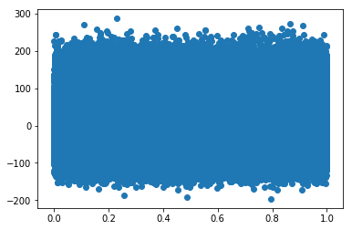

### Questions
- No questions...yet.

### Objectives
YWBAT
* Apply techniques to solve a multiple linear regression problem
* Create multilinear regression models and change them to optimize results

### Outline
- Clone lesson repo to your local
- Breakout groups to build a model
    - both people should be coding
    - 1 person can screenshare
    - you can divide work (divide and conquer!)
    - Save 5-8 minutes to write a conclusion
- Present model to the class (conclusion)


```python
import pandas as pd
import numpy as np
import scipy.stats as scs
import statsmodels.api as stats

from sklearn.model_selection import train_test_split

import matplotlib.pyplot as plt
import seaborn as sns
```

### Task, build a model in 35-40 minutes and present it to the class 
Dataset - ```BNG_cholesterol.csv ```

Target - ```chol```

No. Features - ```13```


```python
df = pd.read_csv("./data/BNG_cholesterol.csv")
df.head()
```


<div>
<style scoped>
    .dataframe tbody tr th:only-of-type {
        vertical-align: middle;
    }

    .dataframe tbody tr th {
        vertical-align: top;
    }

    .dataframe thead th {
        text-align: right;
    }
</style>
<table border="1" class="dataframe">
  <thead>
    <tr style="text-align: right;">
      <th></th>
      <th>age</th>
      <th>sex</th>
      <th>cp</th>
      <th>trestbps</th>
      <th>fbs</th>
      <th>restecg</th>
      <th>thalach</th>
      <th>exang</th>
      <th>oldpeak</th>
      <th>slope</th>
      <th>ca</th>
      <th>thal</th>
      <th>num</th>
      <th>chol</th>
    </tr>
  </thead>
  <tbody>
    <tr>
      <th>0</th>
      <td>46.950938</td>
      <td>1</td>
      <td>1</td>
      <td>165.981331</td>
      <td>0</td>
      <td>2</td>
      <td>152.691434</td>
      <td>0</td>
      <td>1.774223</td>
      <td>2</td>
      <td>0</td>
      <td>7</td>
      <td>3</td>
      <td>265.569780</td>
    </tr>
    <tr>
      <th>1</th>
      <td>47.359284</td>
      <td>1</td>
      <td>4</td>
      <td>134.748286</td>
      <td>0</td>
      <td>2</td>
      <td>132.079047</td>
      <td>1</td>
      <td>0.407640</td>
      <td>2</td>
      <td>0</td>
      <td>7</td>
      <td>0</td>
      <td>269.368061</td>
    </tr>
    <tr>
      <th>2</th>
      <td>58.455787</td>
      <td>1</td>
      <td>4</td>
      <td>129.456617</td>
      <td>0</td>
      <td>0</td>
      <td>164.523754</td>
      <td>1</td>
      <td>5.284900</td>
      <td>2</td>
      <td>0</td>
      <td>7</td>
      <td>4</td>
      <td>244.336917</td>
    </tr>
    <tr>
      <th>3</th>
      <td>56.070298</td>
      <td>1</td>
      <td>4</td>
      <td>124.831749</td>
      <td>0</td>
      <td>2</td>
      <td>181.453944</td>
      <td>0</td>
      <td>1.096476</td>
      <td>1</td>
      <td>1</td>
      <td>7</td>
      <td>2</td>
      <td>237.985356</td>
    </tr>
    <tr>
      <th>4</th>
      <td>44.121116</td>
      <td>1</td>
      <td>4</td>
      <td>109.887955</td>
      <td>0</td>
      <td>2</td>
      <td>110.055090</td>
      <td>1</td>
      <td>0.437412</td>
      <td>2</td>
      <td>0</td>
      <td>3</td>
      <td>1</td>
      <td>245.907334</td>
    </tr>
  </tbody>
</table>
</div>


```python
res = stats.OLS(y, X).fit()
res.summary()
```


<table class="simpletable">
<caption>OLS Regression Results</caption>
<tr>
  <th>Dep. Variable:</th>          <td>chol</td>       <th>  R-squared:         </th>  <td>   0.959</td>  
</tr>
<tr>
  <th>Model:</th>                   <td>OLS</td>       <th>  Adj. R-squared:    </th>  <td>   0.959</td>  
</tr>
<tr>
  <th>Method:</th>             <td>Least Squares</td>  <th>  F-statistic:       </th>  <td>1.800e+06</td> 
</tr>
<tr>
  <th>Date:</th>             <td>Tue, 16 Jul 2019</td> <th>  Prob (F-statistic):</th>   <td>  0.00</td>   
</tr>
<tr>
  <th>Time:</th>                 <td>14:43:57</td>     <th>  Log-Likelihood:    </th> <td>-5.3515e+06</td>
</tr>
<tr>
  <th>No. Observations:</th>      <td>1000000</td>     <th>  AIC:               </th>  <td>1.070e+07</td> 
</tr>
<tr>
  <th>Df Residuals:</th>          <td>999987</td>      <th>  BIC:               </th>  <td>1.070e+07</td> 
</tr>
<tr>
  <th>Df Model:</th>              <td>    13</td>      <th>                     </th>      <td> </td>     
</tr>
<tr>
  <th>Covariance Type:</th>      <td>nonrobust</td>    <th>                     </th>      <td> </td>     
</tr>
</table>
<table class="simpletable">
<tr>
      <td></td>        <th>coef</th>     <th>std err</th>      <th>t</th>      <th>P>|t|</th>  <th>[0.025</th>    <th>0.975]</th>  
</tr>
<tr>
  <th>age</th>      <td>    1.4258</td> <td>    0.005</td> <td>  285.707</td> <td> 0.000</td> <td>    1.416</td> <td>    1.436</td>
</tr>
<tr>
  <th>sex</th>      <td>  -13.2932</td> <td>    0.115</td> <td> -115.276</td> <td> 0.000</td> <td>  -13.519</td> <td>  -13.067</td>
</tr>
<tr>
  <th>cp</th>       <td>    5.8796</td> <td>    0.054</td> <td>  109.203</td> <td> 0.000</td> <td>    5.774</td> <td>    5.985</td>
</tr>
<tr>
  <th>trestbps</th> <td>    0.6679</td> <td>    0.002</td> <td>  283.377</td> <td> 0.000</td> <td>    0.663</td> <td>    0.672</td>
</tr>
<tr>
  <th>fbs</th>      <td>    3.4092</td> <td>    0.142</td> <td>   24.068</td> <td> 0.000</td> <td>    3.132</td> <td>    3.687</td>
</tr>
<tr>
  <th>restecg</th>  <td>    7.3749</td> <td>    0.052</td> <td>  143.157</td> <td> 0.000</td> <td>    7.274</td> <td>    7.476</td>
</tr>
<tr>
  <th>thalach</th>  <td>    0.2956</td> <td>    0.002</td> <td>  159.151</td> <td> 0.000</td> <td>    0.292</td> <td>    0.299</td>
</tr>
<tr>
  <th>exang</th>    <td>    2.8243</td> <td>    0.118</td> <td>   23.995</td> <td> 0.000</td> <td>    2.594</td> <td>    3.055</td>
</tr>
<tr>
  <th>oldpeak</th>  <td>    0.2527</td> <td>    0.048</td> <td>    5.252</td> <td> 0.000</td> <td>    0.158</td> <td>    0.347</td>
</tr>
<tr>
  <th>slope</th>    <td>    2.3585</td> <td>    0.085</td> <td>   27.851</td> <td> 0.000</td> <td>    2.193</td> <td>    2.524</td>
</tr>
<tr>
  <th>ca</th>       <td>    7.0432</td> <td>    0.058</td> <td>  121.056</td> <td> 0.000</td> <td>    6.929</td> <td>    7.157</td>
</tr>
<tr>
  <th>thal</th>     <td>    1.6654</td> <td>    0.030</td> <td>   55.635</td> <td> 0.000</td> <td>    1.607</td> <td>    1.724</td>
</tr>
<tr>
  <th>num</th>      <td>    0.6076</td> <td>    0.043</td> <td>   14.289</td> <td> 0.000</td> <td>    0.524</td> <td>    0.691</td>
</tr>
</table>
<table class="simpletable">
<tr>
  <th>Omnibus:</th>       <td>72929.043</td> <th>  Durbin-Watson:     </th> <td>   2.001</td> 
</tr>
<tr>
  <th>Prob(Omnibus):</th>  <td> 0.000</td>   <th>  Jarque-Bera (JB):  </th> <td>96856.071</td>
</tr>
<tr>
  <th>Skew:</th>           <td> 0.648</td>   <th>  Prob(JB):          </th> <td>    0.00</td> 
</tr>
<tr>
  <th>Kurtosis:</th>       <td> 3.803</td>   <th>  Cond. No.          </th> <td>    576.</td> 
</tr>
</table><br/><br/>Warnings:<br/>[1] Standard Errors assume that the covariance matrix of the errors is correctly specified.


### High AIC/BIC and JB so residuals aren't normalized

### What makes for good AIC/BIC?
The lowest AIC/BIC

- Akaike’s Inflation Coefficient
- Bayes Inflation Coefficient - penalizes for number of features

BIC - the leanest/meanest (low -> best) - penalizes features

AIC - go between (accounting for explanation of variance and takes into account the sample size)

### Tools to use

> BoxCox will fit x to y in a linear relationship because it shows transformation needed to make x and y morenormally related

https://docs.scipy.org/doc/scipy/reference/generated/scipy.stats.boxcox.html

>VIF (Variance Inflation Factor)

https://etav.github.io/python/vif_factor_python.html


```python
residuals = df.chol - res.predict()
```


```python
xs = np.linspace(0, 1, len(residuals))
plt.scatter(xs, residuals)
```


    <matplotlib.collections.PathCollection at 0x1a1e682748>





### Track your model stats in stepwise selection:
{mod1: {features_used:[], p_values:[], AIC:[], BIC:[], JB:[]}}

### Clean Data


```python

```

### Correlation Matrix + Interpretation


```python

```

### Baseline Model Using scipy.stats


```python

```

### Baseline Model Using sklearn


```python

```

### Iterate through models


```python

```

### Cross Validate


```python

```

### Final Model Summary 
- What is your model?
- What transformations/feature engineering/standardization did you do?
- What features are you using and why?
- Interpret your model features using their coefficients
- Recommendations?


```python

```

### Assessment
